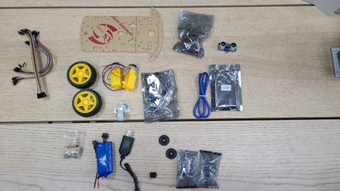
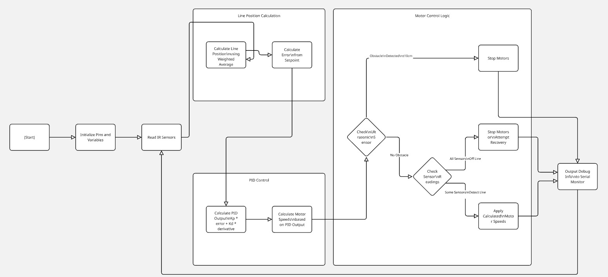

# CSPB476 Line Following Robot

## Project Overview

This repository contains the code and documentation for a line following robot developed for the CSPB476 Spring 2025 competition. Our robot successfully placed third in the competition by implementing PID control for smooth line following, obstacle detection, and the ability to handle both white and black line sections.

## Team Members

- Jesty Jacob - 700038919
- Dhiaeddine Guettouche - 700037569
- Afzal Nujum Navaz - 700037478
- Salem Almarar - 202230389
- Husam AlSabbah - 700040107

## Hardware Components

- Arduino Leonardo microcontroller
- 2-wheel drive chassis with dual motors
- 5-channel IR sensor array (for line detection)
- HC-SR04 ultrasonic sensor (for obstacle detection)
- Motor driver module (L298N)
- Wheel encoders for distance measurement
- Buzzer for milestone notification



## Features

- **PID Control**: Implements Proportional-Derivative control for smooth line following
- **Adaptive Line Detection**: Can follow both white lines on dark surfaces and black lines on white surfaces
- **Obstacle Detection**: Detects obstacles at 10cm distance and stops until the obstacle is removed
- **Milestone Detection**: Identifies special markers on the track and signals with the buzzer
- **End Line Detection**: Properly stops at the finish line
- **Debug Output**: Provides real-time sensor and motor data to the serial monitor for debugging

## Algorithm Explanation

Our robot uses a weighted average approach to determine the position of the line relative to the sensors. The PID controller then calculates the appropriate motor speed adjustments to keep the robot centered on the line.

### Line Position Calculation

The robot uses 5 IR sensors positioned in a row. Each sensor is assigned a position value (0-4), and a weighted average is calculated to determine where the line is:

```
sensor_line = (s1*0 + s2*1 + s3*2 + s4*3 + s5*4) / (s1 + s2 + s3 + s4 + s5)
```

Where `s1` through `s5` are the sensor readings (1 if detecting line, 0 if not).

### PID Control

The error is calculated as the difference between the desired position (center, value 2) and the actual line position:

```
error = setpoint - sensor_line
```

The PD output is then calculated:

```
output = Kp * error + Kd * (error - last_error) / delta_time
```

This output is used to adjust the speeds of the left and right motors:

```
right_speed = base_speed + output
left_speed = base_speed - output
```

## Code Structure

- `white_line_version.ino`: Code specifically optimized for following white lines on dark surfaces
- `black_line_version.ino`: Code specifically optimized for following black lines on white surfaces (used for the inverted sections of the track)

## Technical Highlights

- White line version uses Kp=175 and Kd=80 for high-precision tracking
- Black line version uses Kp=120 and Kd=35 with inverted sensor readings
- Base speed of 60-100 allowed for stable control while maintaining adequate speed
- Weighted average sensor approach provided robust line position detection

## Flowchart

Below is a flowchart illustrating the robot's control logic:



## Competition Results

Our robot successfully completed the competition track with the following achievements:

- Successfully navigated all curves and turns
- Properly detected and stopped for obstacles
- Correctly identified milestone markers
- Completed the course in 1:19 seconds
- Earned 3rd place overall

## Video Demonstration

A video demonstration of our robot completing the course can be found here:
[YouTube Link](https://www.youtube.com/watch?v=0ud6cWR-w9w)

## Setup and Running Instructions

1. Clone this repository
2. Open the Arduino sketch in the Arduino IDE
3. Connect your Arduino Leonardo
4. Upload the sketch to your Arduino
5. Place the robot on the line and power it on

## Lessons Learned

- The PID parameters (Kp and Kd) needed careful tuning for different sections of the track
- Different surfaces required different sensor threshold adjustments
- Sensor positioning was critical for accurate line detection
- Base speed needed to be balanced between speed and control accuracy

## Future Improvements

- Add automatic calibration for different surfaces
- Implement a full PID controller (adding integral component)
- Add automatic line detection (white vs. black)
- Improve recovery when line is lost
- Use encoder feedback for more precise speed control
- Implement mapping capabilities for the track

## References

- [Line Following Robot Tutorial](https://circuitdigest.com/microcontroller-projects/line-follower-robot-using-arduino)
- [PID Control Theory](https://en.wikipedia.org/wiki/PID_controller)
- [Arduino Documentation](https://www.arduino.cc/reference/en/)
